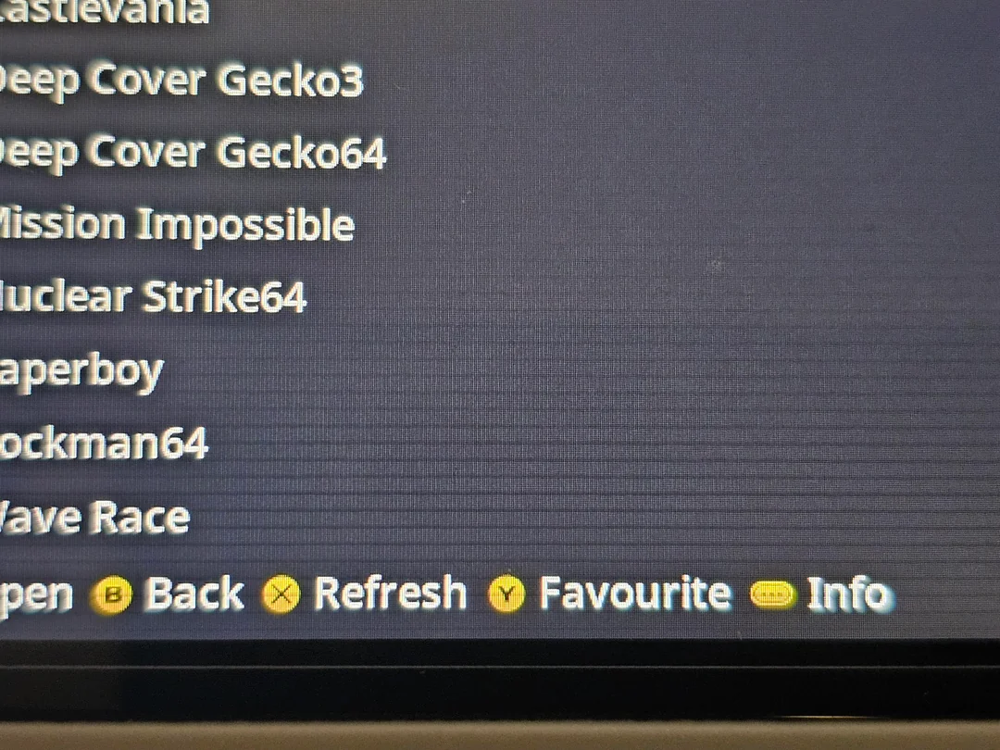
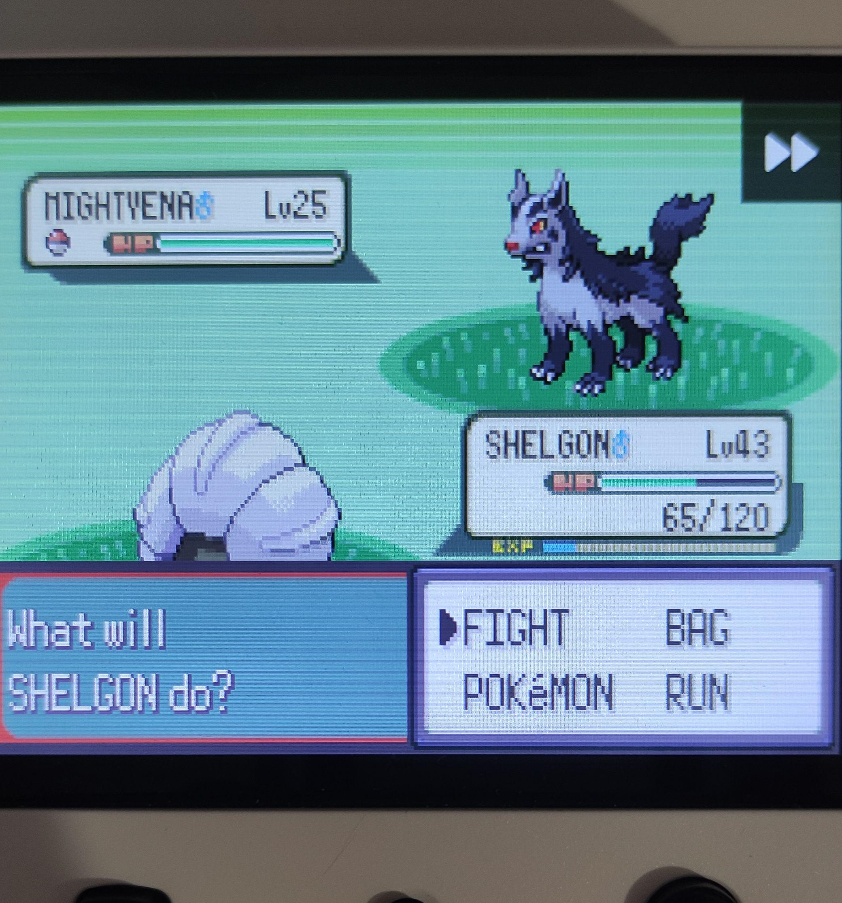

# FexFlasher

A Windows tool to flash `.fex` firmware files to SD cards for muOS devices.

[](LICENSE)

## About

After being affected by the "horizontal lines appearing on screen" issue, I reached out to the muOS devs and they helped me fix it. This issue stems from some devices having a panel that doesn't like the timings used by muOS. I had to extract files from the SD card, change some values, and then reflash the card — all on Linux. This got me thinking that most people are probably using Windows and I wanted to figure out a way to make the process easy.

> **DISCLAIMER:** This has only been tested on my RG35XX H using Windows 11. It should work on the Plus as far as I understand. The included `.fex` file was extracted from my device. Changing screen timings can potentially **damage your screen or brick your muOS installation**. Back up your device and use the tool at your own risk.

My testing: flashed muOS on an SD card, waited for the lines to show, applied the new flash with the tool, and checked to see if the issue was fixed. It fixed 2 SD cards I flashed.





## Installation

Download the latest release from the [Releases page](../../releases).

## Usage

1. Insert your SD card.
2. Run the `.exe` file.
3. Select the removable drive corresponding to your SD card.
4. Click **"Select .fex and Flash"** and choose the `boot_package.fex` file included in the `files` folder.
5. Confirm when prompted.

## Building from Source

Requires [.NET 8 SDK](https://dotnet.microsoft.com/download/dotnet/8.0).

```bash
dotnet publish FexFlasher.csproj -c Release -r win-x64 -p:PublishSingleFile=true -p:SelfContained=true -o published
```

Or use the included build script:

```powershell
.\build.ps1
```

## Special Thanks

- The [muOS](https://muos.dev/) devs on Discord who helped me understand how things work on the RG35XX H.
- u/randomcoder_67 on Reddit for [this amazing guide](https://randomcoder67.github.io/wiki/other/muos-rg35xx-screen-fix.html) on doing the process on Linux.

## Support Me

If you find this project helpful, consider supporting me:

[](https://ko-fi.com/papagamer)

## License

This project is licensed under the MIT License - see the [LICENSE](LICENSE) file for details.
